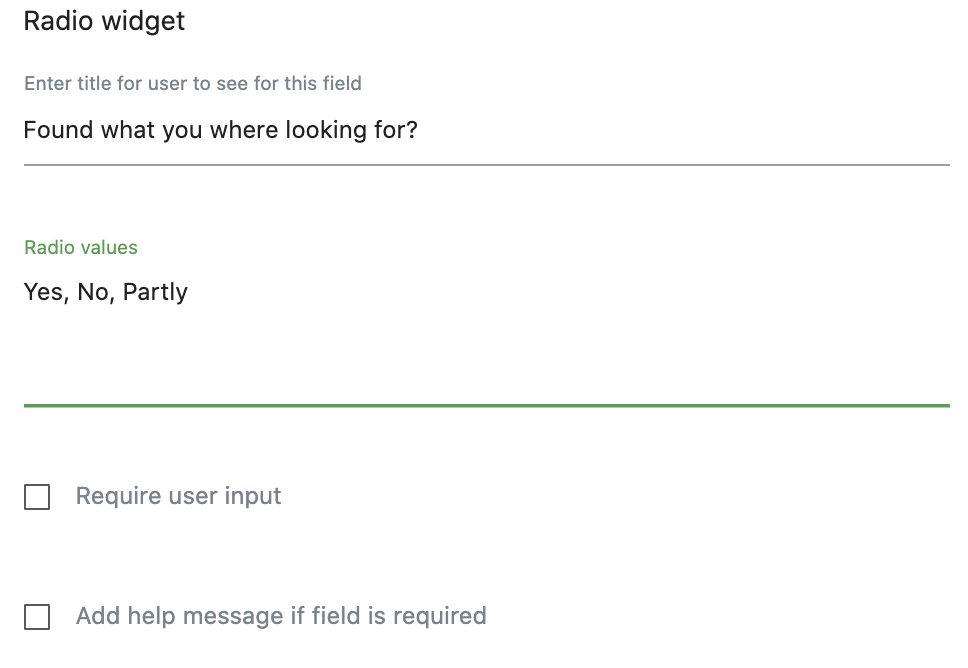
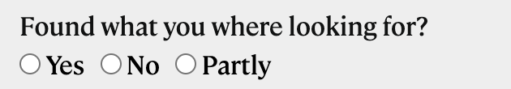
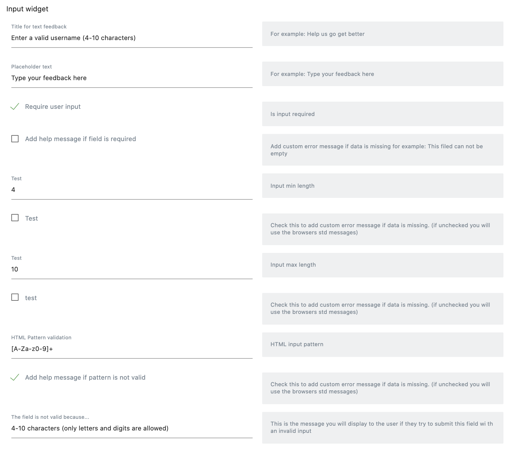
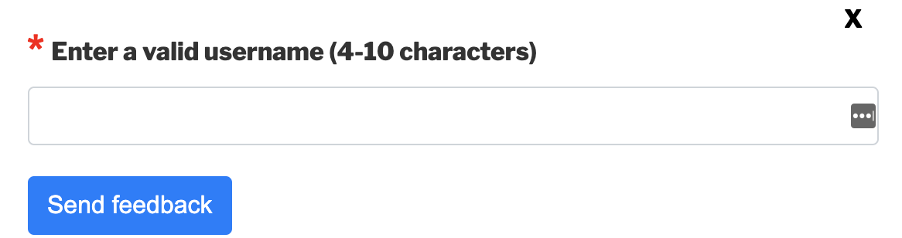

[Home](./index.md) | [Tag manager Basics](./tag-manager-basics.md) | [Form templates](./form-templates.md) | [Form creation](./form-creation.md) | [Form display](./form-display.md) | [Form reporting](./form-reporting.md) | [About](./about.md)

# Form templates | Matomo feedback forms
To enabel more users to set up almost any type of widget combinations we created form templates.

The structure of the templates is based on JSON.
In the longer run we will build a GUI for users, but for now JSON works even thoug it will require some more skills and it will also be possible to create broken JSON that will give us errors in the interface.


## Form template types
We support straight forms (just one page) and steps where you can add any amout of steps to your forms.

### straight forms
Straight forms will only have a submit button.

### step forms
To control multiple steps you will be able to control navigation between steps with buttons.
When you create the forms you will be able to add your custom text to forms.

# Supported widgets (field types) 

We currently support the current fields in a template:
## starsWidget
A simple star voting where you will be able to configure the amount of starts and also add your custom descriptions (on form creation).

## radioWidget
Radio widgets will give you the possibility to add lists of options on form creation. 
You can add a list like:
Yes|No 
or
Pizza|Burgers|Taco

**If your template contains a radio widget this is how the Editor interface will look**



**Output**




## inputWidget
Gives you a html input field that you can modify with the properties

- minLength
- maxLength
- pattern (experimental so far, might need more testing)

The code we generate could look like this:

 <input type="text" id="username" name="username" minlength="5" maxlength="10" pattern="[A-Za-z0-9]+">

**Example of form input**



**Example of output** 




## textAreaWidget
Gives you a text area field

- minLength
- maxLength

The code we generate could look like this:

 <textarea type="text" id="userFeedback" name="userFeedback" minlength="1" maxlength="250">


## submitWidget

Gives you a submit button


# Example of a Straigt form
```
{
    "type": "straight",
    "widgets": [{
        "type": "radioWidget",
        "widgetName": "Radio widget",
        "fields": {
            "fieldname": "radioFeedback",
            "label": {
                "dataTitle": "Radio buttons title",
                "inlineHelp": "For example: <br> Was it easy to fill out this form?"
            },
            "radioValues": {
                "dataTitle": "Radio values",
                "inlineHelp": "For example: Radio values like <br>Yes|Yes<br>No|No<br>Not relevant|Not relevant"
            }
        }
    },
    {
        "type": "textAreaWidget",
        "widgetName": "Text area widget",
        "fields": {
            "label": {
                "dataTitle": "Text feedback title",
                "inlineHelp": "For example: How can we improve?"
            },
            "fieldname": "feedback",
            "placeholder": {
                "dataTitle": "Placeholder text",
                "inlineHelp": "Example: Enter your feedback here"
            }
        }
    }, {
        "type": "submitWidget",
        "widgetName": "Submit button",
        "fields": {
            "text": {
                "dataTitle": "Submit button text",
                "inlineHelp": "The text to display on the Submit button"
            }
        }
    }]
}
```

