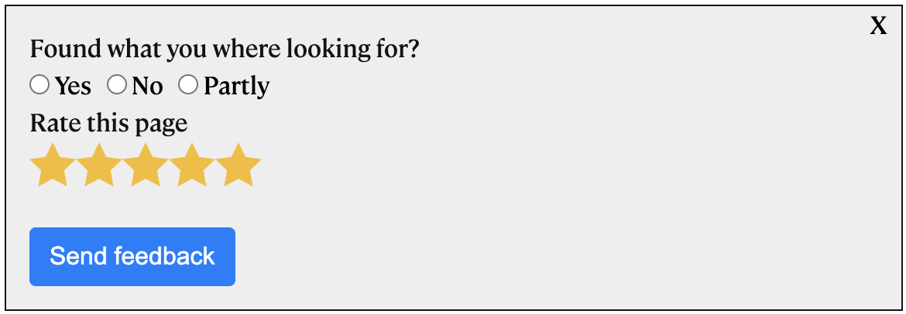

[Home](./index.md) | [Tag manager Basics](./tag-manager-basics.md) | [Form templates](./form-templates.md) | [Form creation](./form-creation.md) | [Form display](./form-display.md) | [Form reporting](./form-reporting.md) | [About](./about.md)

## Welcome the documentation for Matomo User Feedback plugin | Matomo feedback forms

This page documents use cases and will also be the place where you can create feature requests or send bug reports. 

Contact tomas.persson@digitalistgroup.com if you are interested in this plugin. 

# Overall concept
The plugin is used to manage website feedback forms, like surveys and questionares on your web sites.
The unique thing with this plugin is that we build it tightly integrated with Matomo.

## This means:
- Tight integration with Matomos Tag Manager for deployment of your Feedback Forms
- Report data is integrated with the Matomo data. This means that you can filter your report data just like any other data in Matomo by using date ocr segments.
- You can also rely on Matomos API to export the feedback data to any other system

### Support or Contact
For any support or business related questions, contact tomas.persson@digitalistgroup.com

